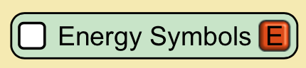

## General Design Considerations

Here’s the when and why we use a checkbox (traditional looking checkbox user interface component) in simulation design.

* Generally, when a secondary or non-essential option needs to be toggled between on and off states
* To toggle more than one option in a group of options
* Checkboxes are often used to allow users to layer on more complex representations, or to view multiple, related represenations simultaneously. More complex options are generally off by default.

**Note this design pattern covers multiple PhET Component Types**
* Question: Are there any other types of visual checkboxes?

## Aesthetic Considerations
* Checkbox appears checked or not checked on simulation load
* Appears with a text-based label, or an icon as the label, or a combination of both text and icon
* Title case is used for text-based labels for checkboxes


## Accessibility Considerations
* HTML checkboxes (i.e., `input type="checkbox"`) and possibly all visual PhET sim checkboxes are two-state controls that represent the element's "checkedness" state.
* Traditional looking checkboxes with visual labels are generally best represented in the PDOM as an `input` of type checkbox with an associated `label` element.
* When the visual label content is an image or a string of text that does immediately translate into a name that clearly communicates what the checkbox is for, non-visually, consider changing the visual string, adding clarifying help text, or providing a more descriptive name as the `label` element's content in the PDOM. Keep in mind that ideally, the visual text and the text in the PDOM should be the same to support users who use voiced commands.
* Groups of related checkboxes may benefit from being explicitly grouped using a containing element (e.g., `fieldset` or `div`) with the ARIA `role="group"`. Grouping checkboxes is optional.
* Explicitly grouped checkboxes may benefit from a group name provided by either an `h3` or a `legend`.
* Checkboxes that appear visually grouped (e.g., by proximity or with a visual box) for convenience or space-saving may not benefit from explicit group semantics in the PDOM.
* When a group is very important, consider using a heading, e.g., `h3` as headings are placed in the heading outline which can be navigated with screen reader software whereas the `legend` element is not placed in the heading hierarchy.

**Note:** Known issue that some screen readers (i.e., VoiceOver) repeat the checkbox's label content when the `label` is associated with the `input` via the `for` attribute. The `aria-label` attribute does not cause any repetition.


### Gesture Support
ToDO.

### Keyboard Support
| Key | Function |
| :-- | :------- |
|Tab | Moves keyboard focus to the checkbox. |
|Space | Toggles checkbox between checked and unchecked states. |


### Management of Role, Property, State, and Tabindex Attributes
Respecting the first rule of ARIA, "use a native HTML element whenever possible", we use native checkbox elements in the PDOM to represent traditional looking checkbox interactions. An HTML checkbox could represent other "switching" interactions that may not visaully look like a checkbox in the simulation, but examples for those are provided elsewhere. Because we use native HTML for checkbox interactions, some of the guidance provided in ARIA Practices for checkbox widgets is not relevant. I have adapted the content from the ARIA practices section for checkbox.
- No explicit ARIA role of checkbox is needed on an native HTML checkbox (`input type="checkbox"`).
- No `tabindex` required, native HTML checkboxes are focusable elements.
- An HTML checkbox has an accessible label (i.e., accessible name) provided by one of two of the following ways:
  - Visible text content contained within a `label` element and assocaited to its `input` with the `for` attribute.
  - Content within an `aria-label` attribute set on the `input` element with `type="checkbox"`.
- When checked, the checkbox element has the attribute `checked` present.
- When not checked, the `checked` attribute is not present.
- When partially checked, it has state `aria-checked` set to `mixed`. *(tri-state checkboxes only)*
- When a set of checkboxes is presented as a logical group with a visible label, the checkboxes are included in an element with `role="group"` that has the property `aria-labelledby` set to the ID of the element containing the label or name for the group.
- When the presentation includes additional descriptive static text (i.e., help text) relevant to a checkbox or group of checkboxes, using `aria-describedby` is an option to provide automatically read help text. We have, however, that automatic helptext is not needed in our sims. Users seem to prefer on-demand help text.


### Simplified HTML Examples for PDOM
#### (Suggested) Options for Checkbox in the A11y API
When creating the common code component, it would be useful to have options to use either a `label` element or an `aria-label` attribute to provide the accessible name for the checkbox. Using `aria-labelledby` is a possible option, but likely rarely the best choice for a native HTML input element.

#### Checkbox with visual label text
##### Energy Forms and Changes
Visual checkbox with a text-based label:


```html
<input id=”energy-symbols” type=”checkbox”> <!-- not checked checkbox-->
<label for=”energy-symbols”>Energy Symbols</label>
<p>Observe energy chunks move and change through system.</p>
```

#### Checkbox without visual label text (option with aria-label)
##### Area Model Introduction
Visual checkbox with different label


```html
<input id="counting-numbers" type="checkbox" aria-label="Counting numbers">
<p>Use area grid with or without counting numbers in grid cells.</p>
```

#### Unnamed group of checkboxes
##### Gravity Force Lab
**Note: still need to finish this example.**

```html
<input id=”” type=”checkbox”> <!-- not checked checkbox-->
<label for=””>Constant Size</label>
<p>When changing mass, observe constant or changing size of spheres.</p>

<input id=”” type=”checkbox”> <!-- not checked checkbox-->
<label for=””>Force Values</label>
<p>Explore value of forces in newtons.</p>

<input id=”” type=”checkbox”> <!-- not checked checkbox-->
<label for=””>Scientific Notation</label>
<p>Listen to newtons in scientific notation.</p>
```

### Supporting Accessibility Resources
* [Using ARIA, working draft](https://www.w3.org/TR/using-aria/)
* [HTML5.1, Section 4.10.5.1.15. Checkbox state](https://www.w3.org/TR/html51/sec-forms.html#checkbox-state-typecheckbox)
* [ARIA Practices 1.1 Section 3.6 Checkbox](https://www.w3.org/TR/wai-aria-practices/)

### Design Doc Content Template Text
**Energy Symbols, Checkbox**
- PhET Component: Checkbox.js
- Accessible Name: Energy Symbols (e.g. Example 1)  
- (Optional) Help Text: (e.g., Observe energy chunks move and change through system.)

TO DO:
- Group example, could use one from GFL series (no heading required)
