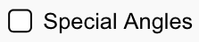

## Design Considerations

We generally use a checkbox in simulation design:

* To toggle on (or off) a secondary or non-essential option;
* To provide a group of options that can be toggled on or off;
* To layer on more complex representations, or to view multiple, related
  represenations simultaneously. More complex options are generally off by default.

## Aesthetic Considerations

* Appear checked or not checked on simulation load.
* Appear with a text-based label, or an icon as the label, or a combination of both text and icon.
* Title case is used for text-based labels for checkboxes.

## Considerations for Interactive Description Design

A checkbox in SceneryStack code renders as a native HTML element with the role of "checkbox." It comes with two native states, "checked" and "unchecked." These details (role and state) are communicated automatically when interacted with when using alterantive input and screen reader software. 

### To be fully screen reader accessible 2 design cycles may be required to complete the design:
* **1 - Core/Essential Description:**
    * _Accessible Name_ - must be unique;
    * _Accessible Help Text_ - must read true in either state;
* **2 - Interactive Description:**
    * Two _Accessible Context Responses_ - one describing what happens upon getting checked, and one that describes what happens upon getting unchecked.

#### Description Desgin Tips
* Avoid using a verb in the name, e.g. "Show Values." It works well for Interactive Descripton where changes in state are always communicated, but it works less well for Voicing where changes in state are only communicated through context responses.
* Capture the idea of two states in the help text, e.g., "Explore with or without units visible."
* Be clear on what the checkbox controls. The word, "Values" alone, can be vague without context. Do you need to be more specific?

#### A checkbox focus event communicates:
* [The designed accessible name] + "unchecked" + "checkbox"

#### A checkbox toggle event communicates:
* Changed state automatically: "checked" or "unchecked" + 
* If designed, [An accessible context response describing what happens for each state change.]

### Example 1 Interactive Description: Greenhouse Effect: 
    * accessible name: "Cloud"
    * accessible help text: "Experiment with cloudy sky."
    * initial state: checked
    * accessible context response unchecked: "Cloud removed from sky."
    * accessible context response checked: "Cloud added to sky."

#### What a learner hears when interacting with the Cloud checkbox:
    * On focus: "Cloud, checked, checkbox"
    * When toggled to unchecked: "unchecked", then "Cloud removed from sky."
    * When toggled to checked: "checked", then "Cloud added to sky."

### Example 2 "Essential/Core" Description : Special Angles in Trig Tour: 
    * accessible name: Special Angles
    * accessible help text: Explore with or without constrained angles.
    * initial state: unchecked
    * accessible context response unchecked: TBD
    * accessible context response checked: TBD

#### What a learner hears when interacting with the Special Angles checkbox: 
    * On focus: "Special Angles, unchecked, checkbox"
    * When toggled to checked: "checked"
    * When toggled to unchecked: "unchecked"

## Considerations for Voicing Design
The [Voicing feature](https://www.w3.org/WAI/ARIA/apg/patterns/checkbox/examples/checkbox/) is a system of responses available to all input methods. Responses are delivered in direct response to user action on focus or on activation. (ToDo: link to about Voicing Response System).

### To have a complete Voicing feature 2 design cycles may be required to design required voicing responses:
* **1 - Core/Essential Voicing:**
    * a _Voicing Name Response_ - must be unique, and ideally identical to the accessible name;
    * _Voicing Help Text Response_ - ideally indicating there are two available states. It is great if the accessible help text and Voicing help text are the same (options available to make them different, if needed);
* **2 - Voicing:**
    * Two _Voicing Context Responses_ - should be identical to the accessible context responses;

#### The Voicing experience of a checkbox can vary based on input method and the Sim Voicing Options that are seletected in Preferences; 
* With keyboard input users: 
    * Always hear voicing name response;
    * Can hear a voicing help text response; 
    * Never hear changed states, "checked" or "unchecked";
    * Can hear a voicing context response.
* With mouse and touch users: 
    * Always hear voicing name response;
    * Never hear voicing help text response;
    * Never hear changed states, "checked" or "unchecked";
    * Can hear a voicing context response.
 
## Keyboard Support
Checkbox operation should be identical across Description and Voicing features.

| Key   | Function                                               |
|:------|:-------------------------------------------------------|
| Tab or Shift + Tab  | Moves keyboard focus to a checkbox.     |
| Space | Toggles a checkbox between checked and unchecked states. |

### Keyboard Shortcuts Dialog
* Checkbox operation is covered by Basics Actions section.
* No additional support needed.

## Gesture Support

* Swipe left or right to move focus.
* Double tap to toggle state of checkbox.

## Supporting Resources for Design and Development
* ToDo - Add links to releveant design resources available in the description design course.
* ToDo - Link to API Quick Start Guides
* [ARIA Authoring Practice Guide: Checkbox Example (Two State)](https://www.w3.org/WAI/ARIA/apg/patterns/checkbox/examples/checkbox/) 
* [Using ARIA, working draft](https://www.w3.org/TR/using-aria/)
* [HTML Living Standard, Section 4.10.5.1.15 Checkbox state (type=checkbox)](https://html.spec.whatwg.org/multipage/input.html#checkbox-state-(type=checkbox))
* [ARIA Authoring Practice Guide: Checkbox Example (Two State)](https://www.w3.org/WAI/ARIA/apg/patterns/checkbox/examples/checkbox/)
 

