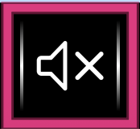
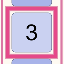
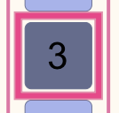
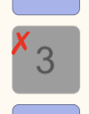
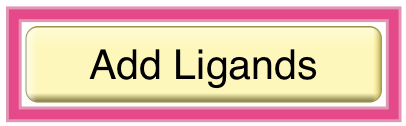
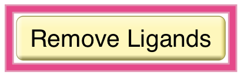
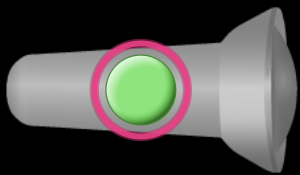
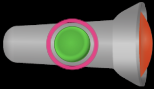

## Toggle Buttons

We use _toggle buttons_ in simulation design to communicate to leaners they can toggle between two defined states. The interaction can be similar to a checkbox, but unlike a checkbox, which has strictly defined 'checked' or 'unchecked' states for visual presentation and for accessibility, a _toggle button_ visual design has more flexibility. This flexibility allows dsigners to make them fun and inviting according to their importance for the interaction. 

PhET has many options for _toggle buttons_. They can be big or small. They can be 'round' or 'rectangular'. They can be 'momentary' or 'sticky.' They can have a look that is pressed or unpressed. They can have a visual name or an icon that changes to display one of two states. They can be placed on a component to look like an on-off button.

In addition to offering visual design flexibility, _toggle buttons_ can be "configured" (i.e. coded) to optimize how they are presented for accessibility.

### Design Considerations

How important is the interaction to the sim experience? 
* Does it need to big, bright and centrally located?
What is the toggle button trying to communicate?
* Is it just the pressed state that is important? 
* Would two unique names or two icons be more effective in communicating the boolean nature of the toggle button?
* Would it make sense to have the pressed and not pressed states be communicated as the "on" and "off" states of a switch (e.g., "Infrared Light Source, off, switch")?

### Accessible Role Configurations for Toggle Buttons
_Toggle buttons_ have three **accessibleRoleConfiguration** options to guide designers (and developers) in creating appropriately accessible _toggle buttons_.  
* **'toggle' option** - adds the _aria-pressed_ attribute to the _button_ element. This type of toggle button explicitly communicates its pressed state on focus, indicating the button is on or has been activated. This type of _toggle button_ does not explicitly communicate its unpressed state, but genrally communicates itself as a "toggle button," rather than a "button" when accessed with assistive technology.
* **'button' option** - creates a button element with a dynamic visual name or changing icon. This type of _toggle button_ does not have a pressed state. The name or the icon is communicating its current state. 
* **'switch' option** - uses two attributes _role='switch'_ and _aria-checked_ to make the _toggle button_ sound like an on-ff switch instead of a button.

Designer NOTE: The **accessibleRoleConfiguration** determines the description design needs for the toggle button. The visual design of the _toggle button_ should be considered in determining the most aapropriate **accessibleRoleConfiguration**, but they are not required to match exactly. The **accessibleRoleConfiguration** is meant to help designers choose a described interaction pattern that will effectivley communicate the sim interaction to learners who rely on description. For example, it may be more effective to use the 'toggle' option for accessibility even if the actual visual design has a changing icon. See examples below.

### Description Design Considerations

* Toggle buttons are generally considered simple UI components.
* Required to be made fully accessible during the _Core Description_ design phase.
* Warning: When a toggle button turns a component on, and that action start a series of events that are central to the simulations learning goals, it may not be possibe to make the interaction fully accessible in the _Core Description_ design phase (e.g., _Molecules and Light_, _Models of the Hydrogen Atom_).

#### Description Design Needs for Toggle Buttons:
Generally, a toggle button requires an accessible name, may benefit from accessible help text, and will likely need two accessible context responses, one for each state as the state is toggled during interaction. Designers need to make sure the description design fits the chosen **accessibleRoleConfiguration** for accessibility.

* **'toggle' option** - typically works well with a single unique accessible name, and 2 context responses that confirm the changed states upon interaction. The pressed state is communicated through the code to screen reader users. The button may also be communicated as a "toggle button" rather than just "button."
* **'switch' option** - typically works well with a single unique accessible name (or name with a simple changing parameter, see examples), and 2 context responses that confirm the changed states of on and off. The name and the responses need to work well with the role of "switch" role and the states of being "on" and "off".
* **'button' option** - when two visually displayed names represent the boolean states, it works best to have matching unique accessible names, and 2 context responses that confirm the changed states.  
* **'button' option** - when two visually displayed icons represent the boolean states, it can work well with dynamic names that match the icons and 2 confirmatory context responses. It can also work well to use the 'toggle' configiration with a single unique name. Since the words are not visually displayed, there is some wiggle room in the accessible design. The accessible design of iconic 'boolean' toggle buttons can be tricky for description and voicing features. The description for some commonly used iconic buttons are handled in common code (e.g., Pause/Play).  

#### Design Doc Template for _Core_ or _Interactive Description_

		accessibleRoleConfiguration: 'toggle', 'button', 'switch'
		accessibleName: 
		accessibleHelpText: (always optional, can be dynamic)
		accessibleContextResponseOn: 
		accessibleContextResponseOff:
    
		Initial state of the toggle: 

#### Examples for the 'toggle' Configuration
##### "All Audio" Button - Bottom NavBar

		accessibleRoleConfiguration: 'toggle'
		accessibleName: All Audio
		accessibleHelpText: N/A
		accessibleContextResponseOn: All audio on.
		accessibleContextResponseOff: All audio off.
    
		Initial state of the toggle: All audio button is in the pressed or 'on' state by default.

##### Number Buttons: Number Pairs Game Screen

This toggle button is technically a 'toggle', but has some additional complexity due to the need for a dynamic name and the need for a disabled state.

		accessibleRoleConfiguration: 'toggle'
		accessibleName: {{numberAnswer}}
		accessibleName when wrong: {{numberAnswer}}, wrong answer
		accessibleHelpText: ??
		accessibleContextResponseOn: ??.
		accessibleContextResponseOff: ??.
    
		Initial state of the toggle: Not pressed or 'off' by default.

#### Example for the 'button' Configuration
##### Add/Remove Ligands Button - Membrane Transport

		accessibleRoleConfiguration: 'button'
		accessibleName: Add Ligands
		accessibleName: Remove Ligands
		accessibleHelpText: Add or remove triangle- and star-shaped ligands to outside of cell.
		accessibleContextResponseOn: Outside flooded with ligands.
		accessibleContextResponseOff: Ligands removed.
    
		Initial state of the toggle: Not pressed or 'off' by default.

##### Example for the 'switch' Configuration
###### Light Source Switch - Molecules and Light

This example is from a simulation with full _Interactive Description_, not _Core Description_. The robust series of context responses that describe all the molecule excitations would need a much simpler solution during a _Core Description_ design phase. A team might also choose to keep the dynamic help text static during a _Core Description_ design phase, e.g., "Turn light source on or off to start or stop photons".

		accessibleRoleConfiguration: 'switch'
		accessibleName: {{lightSourceName}} Light Source
		accessibleHelpTextResponse (when off): Turn light source on to start photons.
		accessibleHelpTextResponse (when on): Turn light source off to stop photons.
		accessibleContextResponseOn: A series of context responses with long and short versions that describe molecule excitations.
    	accessibleContextResponseOff: Photons off.
    
		Initial state of the toggle: Not pressed or 'off' by default.

### Voicing Design Considerations 
In the Voicing experience, none of the _role_ and _state_ information that comes from the code is announced. The voiced information also varies based on input method and the _Sim Voicing Options_ selected in _Preferences_. 

* With keyboard input, users: 
    * Always hear a voicing name response.
    * Can hear a voicing context response. The context response can come before the name if that makes more sense when toggling between states.
    * Can hear a voicing help text response on focus.
    * Never hear built-in states or changed states on focus, i.e., "selected", "on" or "off".
    * Never hear role information on focus, i.e., "toggle button", "button", or "switch".
* With mouse and touch users: 
    * Always hear a voicing name response.
    * Can hear a voicing context response. The context response can come before the name if that makes more sense when toggling between states.
    * Never hear a voicing help text response.
    * Never hear built-in states or changed states, i.e., "selected", "on" or "off".
    * Never hear role information, i.e., "toggle button", "button", or "switch".
   
#### Design Doc Template and Voicing Design How-To
Ideally, the design goal is to create a description design where the accessible descriptions can be used as-is for the _Voicing_ feature. 

Typically, _Toggle Button_ interactions can use the same descriptions designed for _Core_ or _Interactive Description_ in the _Voicing_ feature. Options are available to make them different, if needed. For _toggle buttons_, the most likely places to have changes would be around the ordering of the voicingName and voicingContextResponses, and possibly the shortening of voicing help text.

Ideally, the design goal is to create a design where the accessible descriptions can be used as-is for the _Voicing_ feature. 

    voicingeNameResponse=accessibleName
    voicingHelpTextResponse=accessibleHelpText 
    voicingContextResponseOn=accessibleContextResponseOn
    voicingContextResponseOff=accessblexContextResponseOff

    Note where identical descriptions might cause design challenges for Voicing delivery.
 
## Alternative Input
| Key   | Function                                               |
|:------|:-------------------------------------------------------|
| Tab or Shift + Tab  | Moves keyboard focus to a toggle button.     |
| Space or Enter | Toggles the state of a toggle button. |

* Keyboard operation of _Toggle Button_ should be identical across _Description_ and _Voicing_ features.
* Keyboard instructions for _Toggle Button_ are covered by the _Basics Action_ section of the _Keyboard Shortcuts_ dialog.

### Gesture Support
* Swipe left or right to move focus to the checkbox.
* Double tap to toggle state of the button.

## Supporting Resources for Description Design and Development
* [Description Design Guide: Core](https://docs.google.com/document/d/1kCivjmuXiMzrFkYUigZFgDkssoEWGW_-OaXDk9myV00/edit?tab=t.0#heading=h.rj5etgrq1nf7)
* [Core Description Options](https://github.com/phetsims/phet-info/blob/main/doc/core-description-options.md)
* [Core Description Quick Start Guide](https://github.com/phetsims/phet-info/blob/main/doc/core-description-quickstart-guide.md)
* [Core Voicing Quick Start Guide](https://github.com/phetsims/phet-info/blob/main/doc/core-voicing-quickstart-guide.md)
* [About the Interactive Description Feature](https://phet.colorado.edu/en/inclusive-design/features?section=interactive-description)
* [About the Voicing Feature](https://phet.colorado.edu/en/inclusive-design/features?section=voicing)
* [Interactive Description Design Course (available on Coursera)](https://www.coursera.org/learn/description-design-for-interactive-learning-resources).

