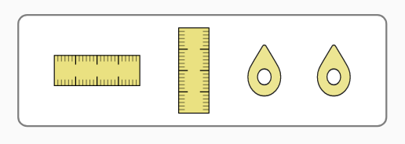

## Toolbox Design Pattern

Here’s the when and why we use a toolbox pattern.

- The toolbox pattern is a custom interaction pattern used to group 2 or more tools (e.g., measurement tools). These tools can be added to the Play Area of a simulation for different purposes.
- The tools in the toolbox present as button interactions. They are placed in the PDOM order as single focusable objects (i.e., no grouping behavior yet available on the toolbox).
- The activated tool is visually transformed, receives focus, and becomes draggable with Arrow keys (and alternatives).

**Note: This pattern is also referred to as the [Creator Pattern](https://phetsims.github.io/scenery/examples/creator-pattern.html).**

## Aesthetic Considerations
* Toolbox appears in a visually defined space like a outlined box.
* The toolbox and tools usually appear without any visual names, but in some cases visual names appear in addition to the tools (e.g., Circuit Construction Kit: AC, Membrane Transport).
* Title case is used for text-based tool names.
* An activated tool becomes full size. Depending on input method, the full-sized tool is dragged to a desired placed by the learner (pointer input), or it is placed near the toolbox or automatically in a useful place in the Play Area.


## Interaction Design Considerations for Alternative Input
- Ensure the PDOM placement of the activated tool makes sense to the use of the activated tool.
- Ensure focus goes on the activated tool so it can be easily moved once activated.
- Ensure it is not too easy to accidentally return the tool to the tool box when using Alt Input.
- Ensure the Escape key works to return a focused-activated tool to the toolbox.
- Consider sim-specific shortcuts to make using the tool more efficient and effective for Alternative Input users.


### Keyboard Interaction & Support
| Key | Function |
| :-- | :------- |
|Tab | Moves keyboard focus to the first/next tool in the toolbox. (No grouping option at this point.) |
|Shift + Tab | Moves keyboard focus to the previous tool in the toolbox (or out of the toolbox to the previous focusable item). |
|Space or Enter | Activates or grabs the focused tool. |
|Arrow keys | Move the focused-activated tool. |
|WASD keys| Work as an alterantive to the Arrow keys to move the focused-activated tool. |
|Escape | Returns the focused-activated tool to the toolbox. **Note: Visual proximity may also return the focused-activated tool to the toolbox.** |
**Note: Optional: Sim-specific shortcuts can be designed and implemented to jump a focused-activated tool to useful places in the simulation.**


## Toolbox Visual Example
- Geometric Optics
  Visual toolbox with no visual names:
  


## Checkbox as Alternative to the Toolbox Pattern
The checkbox interaction can be used as an alternative to using the toolbox pattern. If a checkbox is used:
1. The Escape key **does not** work as a shortcut to uncheck the checkbox, and thus hide the activated-focused tool.
2. A tool activated by a checkbox does not need an additional two-step drag interaction. The action of checking the checkbox is the user's intentional activation of the tool. The Arrow keys (or alternatives) are then immediately operable to move the tool. For tools in a toolbox, the pressing of Space or Enter indicates the user's intention in the same way.
3. Like other tools, tools activated by a checkbox need consideration for sim-specific shortcuts to make using the tool more efficient and effective for Alternative Input users.


## Description Design Considerations (Future)
- The tool activation step for both the toolbox and the checkbox tool provides the opportunity to give instructions to blind users once description is implemented. The activation step is what was determined to be needed for BASE's Yellow Balloon, Friction's Chemistry Book, and others (Faraday's Law, Gravity Force Lab) where the custom draggable object is already in the Play Area.
- It's these "already-in-the-Play-Area" draggable sim objects that may need to be revisited once the sims that contain these readily available draggable objects get a description feature.

#### State Descriptions
```html
<h3>Toolbox</h3>
<p>Grab a ruler or marker as needed.</p>
<button>Horizontal Ruler</button>
<button>Vertical Ruler</button>
```
#### Responsive Descriptions
* When activated: Added to {{locationInPlayArea}}. Use Arrow keys or W, A, S, or D keys to move {{Horizontal Ruler}}.
* When returned: Back in toolbox.
