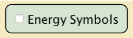
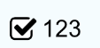

* A11y role: checkbox
* Design Pattern: Spacebar

## Checkbox with visual label/string
```html
<input id=”energy-symbols” type=”checkbox” notchecked>
<label for=”energy-symbols”>Energy Symbols</label>
```


| Primary Element        | Label | Help Text/Content |
| ------------- |:-------------:| -----:|
| Checkbox | Energy Symbols, checkbox (checked, unchecked) | Observe energy chunks move and change through system |

## Checkbox without visual label/string (option with aria-label)

```html
<input id="counting-numbers" type="checkbox" aria-label="Counting numbers" notchecked>
```



| Primary Element        | Label | Help Text |
| ------------- |:-------------:| -----:|
| Checkbox | Counting numbers, checkbox (checked, unchecked) | Count each unit of area  |